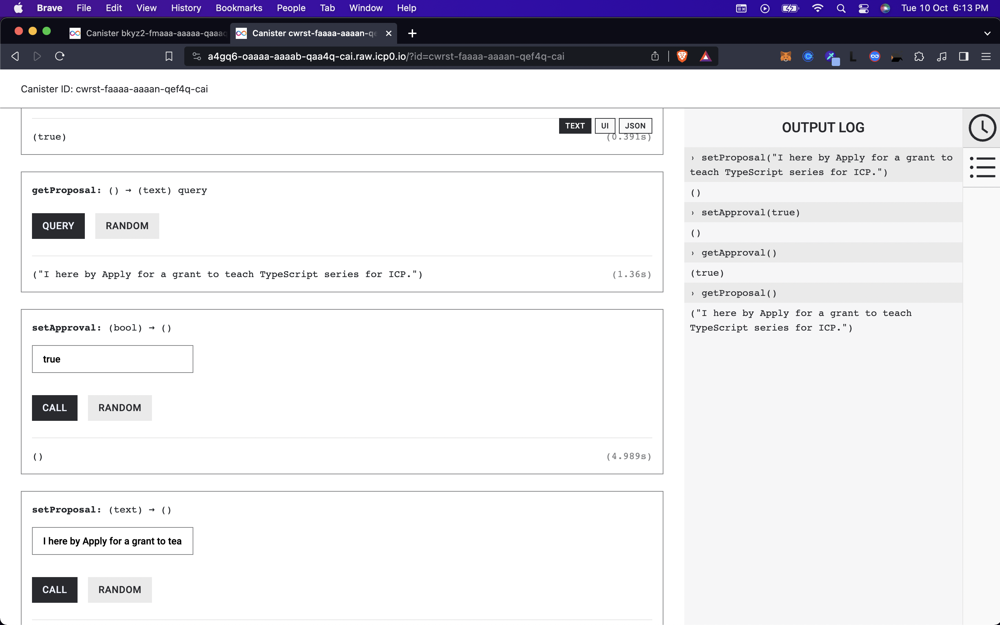
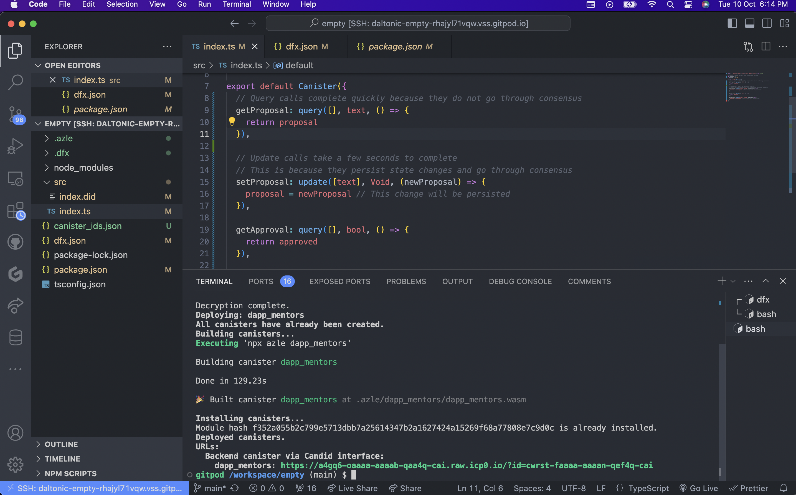

# Sample Deployment of a Canister to the ICP Blockchain Network By Dapp Mentors

This repository contains a sample deployment of a canister to the Internet Computer (ICP) blockchain network using the DFINITY dfx command-line tool.

## Deployment Steps

To deploy the canister to the ICP network, follow these steps:

1. Clone this repository (if you haven't already).

2. Open a terminal and navigate to the project directory.

3. Run the following command to deploy the canister to the ICP network:

   ```sh
   npm run canister_deploy_mainnet

## Output
Two spaces for outputs:


Output 1: Code online via Candid UI


Output 2: Coding UI

## Live Demo
https://a4gq6-oaaaa-aaaab-qaa4q-cai.raw.icp0.io/?id=cwrst-faaaa-aaaan-qef4q-cai
